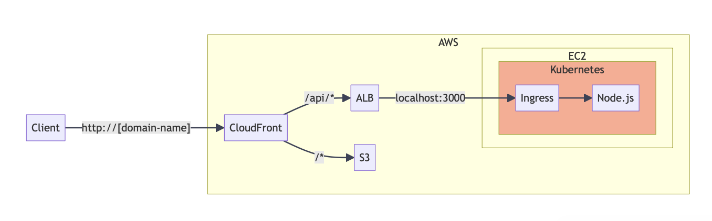

#  Node.js App with Kubernetes & PostgreSQL

이 프로젝트는 **Node.js 애플리케이션과 PostgreSQL 데이터베이스**를 Docker 컨테이너로 구축하고, **Kubernetes(K3s)** 클러스터에 배포하여 마이크로서비스 아키텍처(MSA) 환경을 구성한 실습 레포지토리입니다.

---

##  Architecture


###  Traffic Flow
1. **Ingress (Traefik):** 외부 트래픽을 수신하여 내부 서비스로 라우팅 (L7)
2. **Service (NodePort/ClusterIP):** Pod 부하 분산 및 네트워크 노출
3. **Deployment (Node.js):** 웹 애플리케이션 로직 처리 (Replicas: 2)
4. **PostgreSQL:** `postgres`라는 내부 DNS를 통해 백엔드와 연결

---

##  Tech Stack

| Category | Technology | Description |
| --- | --- | --- |
| **Backend** | Node.js, Express | REST API 서버 구현 |
| **Database** | PostgreSQL | 사용자 데이터 저장 (Persistent Storage 고려) |
| **Container** | Docker | 애플리케이션 및 DB 컨테이너화 |
| **Orchestration** | Kubernetes (K3s) | 배포, 스케일링, 서비스 디스커버리 관리 |
| **Networking** | Traefik Ingress | 외부 트래픽 라우팅 및 로드 밸런싱 |

---

##  Directory Structure

```bash
.
├── Dockerfile                  # Node.js 앱 이미지 빌드 설정
├── server.js                   # Express 웹 서버 소스 코드
├── package.json                # 의존성 관리
├── deployment.yaml             # Node.js 앱 배포 (Replicas: 2)
├── service.yaml                # Node.js 서비스 (NodePort: 31000)
├── ingress.yaml                # Ingress 라우팅 설정
├── postgres.deployment.yaml    # PostgreSQL DB 배포
└── postgres-service.yaml       # DB 내부 통신용 서비스 (ClusterIP)